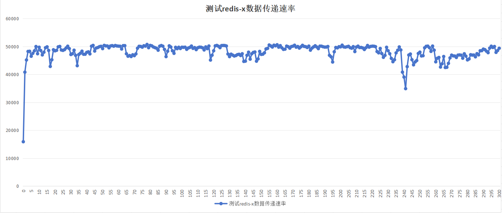
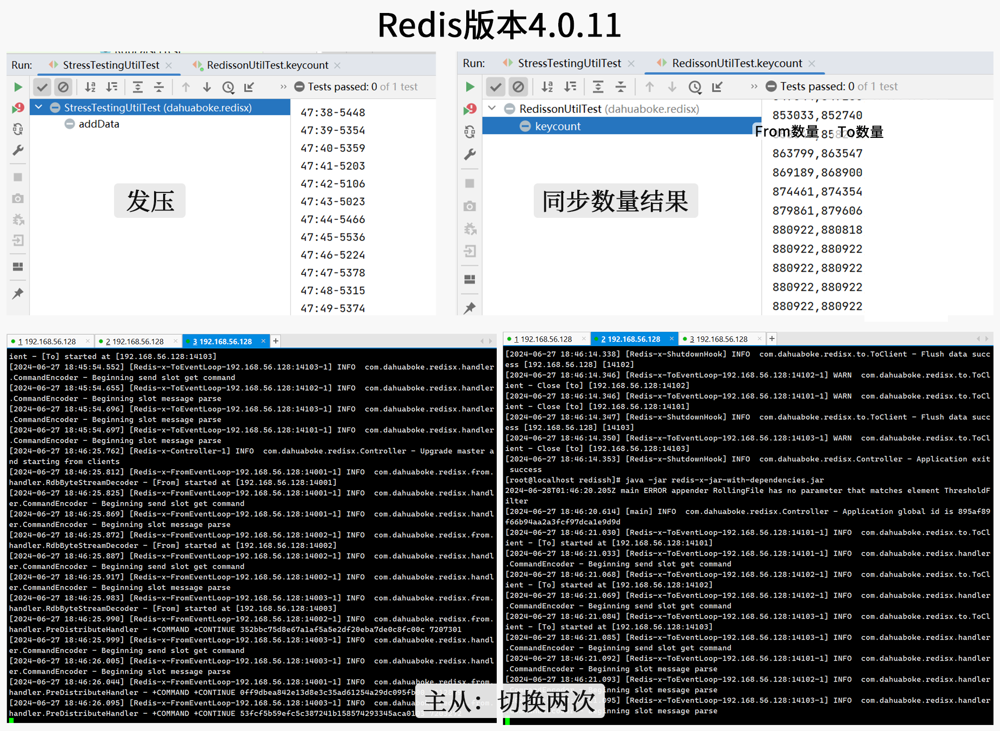
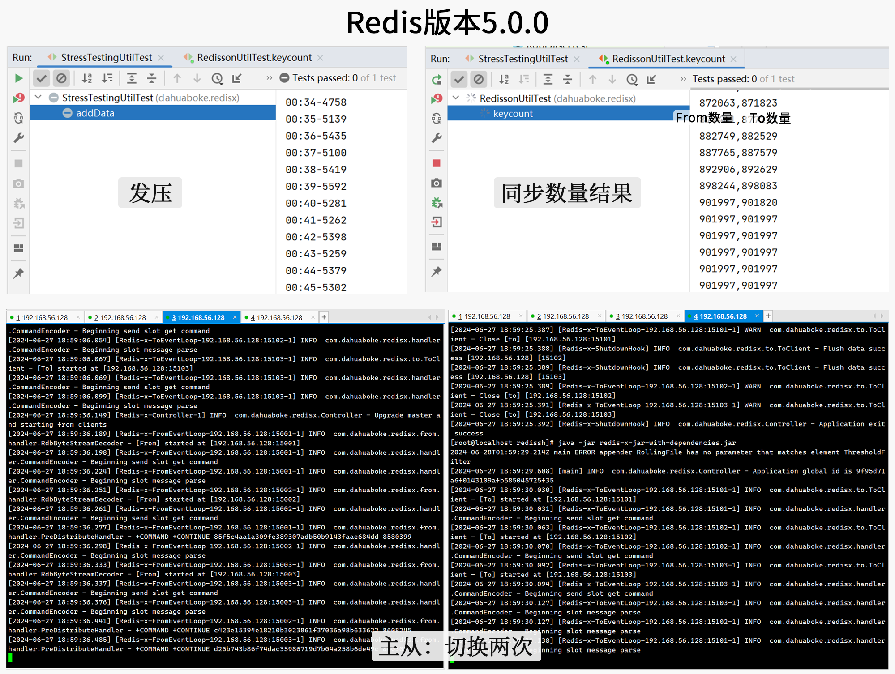
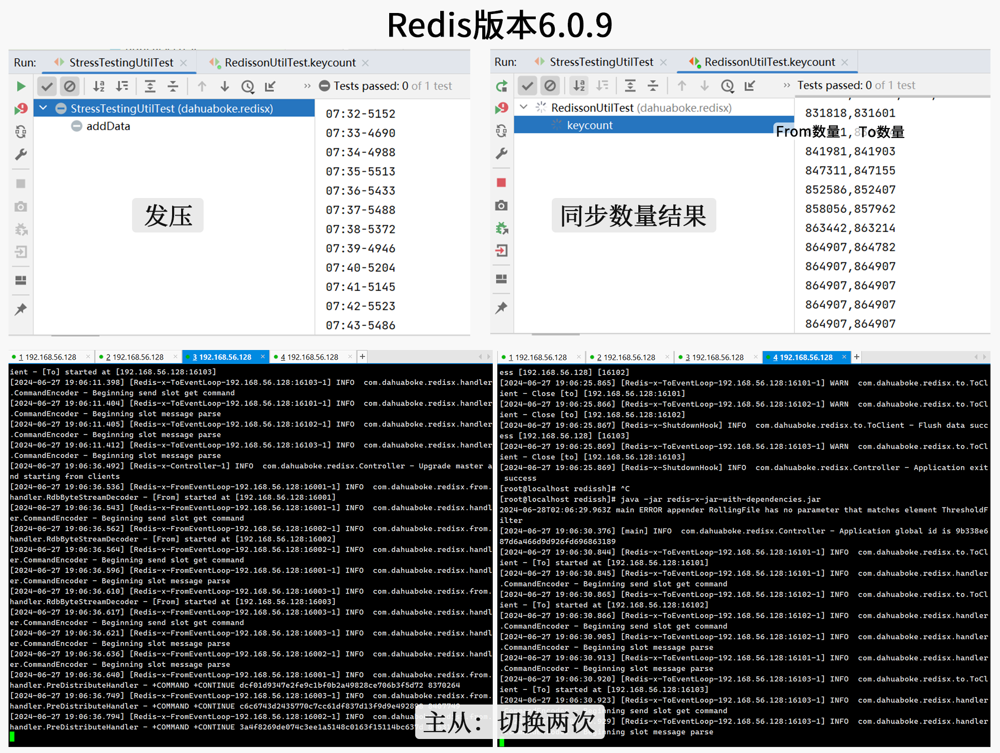
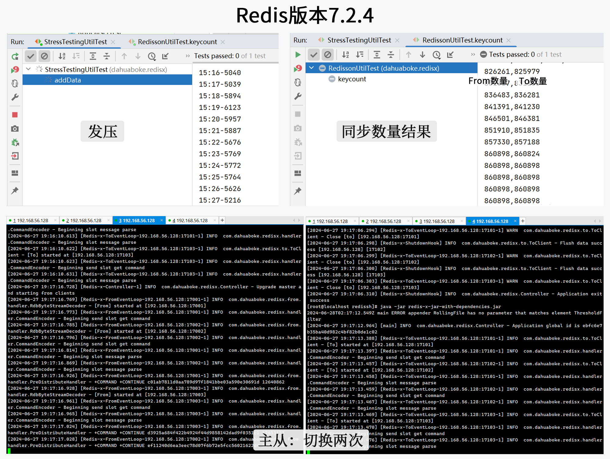

## Redis流复制工具Redis-x

### 作者

大花团队（详见github提交者），redis相关材料请关注[material项目](https://github.com/970263611/redis-x-material)

### 名词解释

From：数据来源的Redis集群对应Redis-x中的节点。

To：需要被同步数据的Redis集群对应Redis-x中的节点。 	

### 启动环境

环境需求为Jdk1.8+，启动指令为java -jar redis-x.jar

### 建设思路


#### 组件对比

| 组件           | redis-x               | alibaba shake                     |
| -------------- | --------------------- | --------------------------------- |
| 支持版本       | 2.8及以上             | 2.8及以上                         |
| 高可用         | 集群部署，纵向扩展    | 单机部署                          |
| 初始化同步方式 | 全量同步rdb，增量同步 | 全量同步rdb和aof，增量同步        |
| 支持续传       | 支持                  | 不支持                            |
| 数据类型       | 五种基本类型 + stream | 五种基本类型 + stream + 3种mudule |
| 其他功能       | 数据查询              | 数据筛选                          |

### 性能测试

CPU为13600KF、内存为DDR5 64G（32G双通道）的电脑上搭建3主3从两套redis集群，发压工具（30并发）和redis-x同时运行，在redis-x没有特殊指定启动内存大小、没有-server启动、jdk为1.8的形况下，测试结果如下：



### 准确性测试

在默认模式下（笔记本中测试，因为反复测试切换场景，所以数据传递落后于发布数量）：

Redis：2.8.0（双端单机，此版本Redis不支持集群。Redis-x组件2节点）


Redis：3.0.3（双端集群，3主3从。Redis-x组件2节点）


Redis：4.0.11（双端集群，3主3从。Redis-x组件2节点）



Redis：5.0.0（双端集群，3主3从。Redis-x组件2节点）



Redis：6.0.9（双端集群，3主3从。Redis-x组件2节点）



Redis：7.2.4（双端集群，3主3从。Redis-x组件2节点）



### 模式支持

#### Reids双端模式：

源：集群 - 入：集群

源：单机/哨兵 - 入：集群

源：集群 - 入：单机/哨兵

源：单机/哨兵 - 入：单机/哨兵

#### Reids-x模式

##### 默认模式

默认采用一秒一次的频率提交偏移量，100条/100毫秒频率提交数据至To端集群，此模式吞吐量较高，和强一致模式互斥。

##### 强一致模式

强一致模式每条数据写入To集群后都会强制同步一次偏移量，此模式稳定性较高，和默认模式互斥。

##### 强制全量同步数据模式

强制全量同步数据模式为每次启动都会强制全量同步主/从所有数据信息，大数据量下初始会存在延迟，但是可以保证数据幂等性，此模式不与其他模式互斥。

### 配置介绍

项目启动如无指定配置文件时会自动扫描resources目录下的redisx.yml，如果需要指定配置文件需要在启动指令后添加配置文件地址。如：

```shell
java -jar redisx.jar redisx.yml
```

连接配置文件中参数：

```yaml
redisx:         
  from:
  	redis:
      version: 6.0.9          #From端redis版本，From和To可以不一致（必要参数）
    password: 1a.2b*          #From端redis密码
    isCluster: true           #From端redis是否为集群
    address:
      - 127.0.0.1:16001       #From端redis集群地址（必要参数）
      - 127.0.0.1:16002
      - 127.0.0.1:16003
  to:
    password: 2b*1a.          #To端redis密码
    isCluster: true           #To端redis是否为集群
    address:
      - 127.0.0.2:16101       #To端redis集群地址（必要参数）
      - 127.0.0.2:16102
      - 127.0.0.2:16103
  console:
    enable: false             #是否启用控制台，控制台主要用于双向查询数据
    port: 9999                #控制台发布端口
    timeout: 5000             #控制台查询时间
  immediate:                  
    enable: false             #是否开启强一致模式
    resendTimes: 3            #强一致模式下写入失败重试次数
  alwaysFullSync: false       #全局是否强制全量同步数据模式
  switchFlag: REDIS-X-AUTHOR:DAHUA&CHANGDONGLIANG&ZHANGHUIHAO&ZHANGSHUHAN      #redis-x主从切换标志，在纵向扩展时需要配置
  syncRdb: false              #是否同步rdb文件，否：只进行增量同步
```

from端希望配置从节点，主节点也可以，但是不要同时连接，会造成数据多次写入。to端只能配置主节点，否则会造成数据丢失。

### 高可用

Redis-x组件天然支持多节点启动，多节点间会自动选举一个主节点，当主节点宕机10秒后，从节点们会自动选举一个新的主节点。

#### 纵向扩展

纵向扩展场景一般存在于一端为集群模式时，Redis-x组件可自动剔除非配置节点hash槽数据，多节点可通过多组并行模式进行纵向扩展。


### 控制台使用

**注**：不建议生产启动，不建议端口开发访问

```
http://${ip}:${port}/console?command=${command}&type=from/to   
#command为具体指令,type:为from查询from端redis数据，为to查询to端redis数据
如：
http://localhost:9999/console?command=get testKey&type=from
http://localhost:9999/console?command=get testKey&type=to
```

### 建设中问题回顾

#### Rdb流解析时服务断连问题

表象：此问题在建设过程自测中不存在，大批量测试时发现Reids-x组件在同步完Rdb流数据后就会和主/从节点断开连接。

排查：通过分析日志发现系统处理并无异常，通过抓包工具发现大批量测试时系统在处理Rdb流文件时会导致Ack线程没有及时执行，经过分析发现是处理中阻塞主线程导致，调整成异步处理，阻塞等待同时发送心跳。

#### ShutdownHook函数内容部分执行

表象：我们注册了ShutdownHook函数用于处理缓冲区数据不丢失，实际过程中发现此函数只执行部分逻辑，缓冲区数据丢失，由于此函数无法断点调试，我们加了很多日志，测试过程中发现日志打印不全也没有规律。

排查：此问题为两部分：1.逻辑只执行部分导致数据丢失；2.日志输出不全。经过排查发现关闭函数为异步，需要同步阻塞或者添加监听器来等待关闭事件，但是由于程序中只是提交了关闭事件就导致无法平滑关闭程序就中止了，此问题调整成同步等待关闭事件，经过测试数据无丢失问题了。日志打印不全经过分析是因为多个ShutdownHook间是并发执行且无顺序，所以log4j2注册的ShutdownHook事件和我们注册的会冲突，导致有些日志无法记录，此问题是因为恰巧我在调试时使用了sysout输出方式发现sysout可以正常打印而发现，解决方案是关闭log4j2注册的ShutdownHook事件，在我们的ShutdownHook事件最后手动调用log4j2的ShutdownHook事件，经过测试日志可以正常打印。

#### 高可用产生的脑裂问题

表象：双节点同时为主节点，offset发生错乱。

排查：此问题无法完全规避，因为设置10秒等待抢占、1秒写入机制，所以程序恰巧同时执行到此段逻辑都认为自己应该升主，所以导致脑裂。不过此问题可以尽可能规避发生概率，由于java语言对于秒、毫秒、微妙、纳秒等时间精度处理不同，所以将之前的秒单位换成微妙单位（纳秒太夸张），这样虽然设置的时间没变，但是在高精度下尽量规避程序错误认知升主问题，同时加上lua表达式先查再写，尽最大可能规避脑裂问题，经过测试无法复现脑裂问题，但是理论上仍存在脑裂可能。

注：本问题发生在节点间同时启动时，如果我们让节点错峰启动，那么就可完全规避此问题，但是程序是严谨的，我们仍在思考解决方案希望在任何情况下都可以规避此问题。

#### Netty channel isWritable引发的惨案

表象：由于双录项目组试用时发现存在空格回车符同步失败的问题（通过redis client无法写入空格等，我们没有针对空格处理），所以对数据解析过程进行了优化。改造后发现指令同步时会发生同步速率触底，在减少单次写入指令数量后，速率回升，增加单次写入数量，速率降低。

排查：程序中兜底设置了每100毫秒刷新缓冲区一次，但是刷新缓冲区间隔远超100毫秒。通过使用arthas及断点排查等方式，未发现写入及刷新过程耗时。继续排查外层方法，最终发现是channel.isWritable的条件判断导致的，当写入大量数据时，会导isWritable长期处于false阶段，所以无法进行下一次刷新缓冲区操作。

注：Netty对于写入缓冲区设置了高水位（默认64k）和低水位（默认32k），在缓冲区写入数据大小达到了高水位，isWritable就会返回false，这时需要执行刷新缓冲区方法将缓冲区数据大小发送出去降低到低水位后，isWritable才会返回true，由于程序中使用了isWritable判断条件，就导致了程序在发送数据时无法进行缓冲区写入，所以导致tps触底。在减小单词写入指令数量后，可以让缓冲区更快进行刷新，同时水位下降的更快，就可以升高tps，符合表象。
